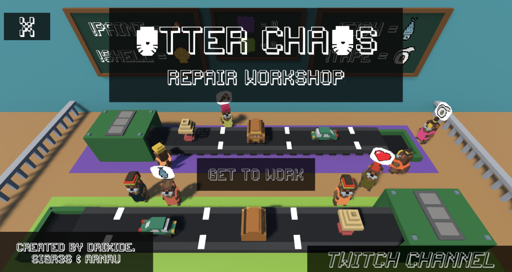

# Otter Chaos Repair: twitch chat game 👾

This is the back end for the online twitch-chat game [otter chaos](https://github.com/sigr3s/Otter-Chaos).

This game was designed, built and deployed in 24 hours by [Sergi Tortosa](https://github.com/sigr3s), [Adria Abella]() and [me](https://github.com/monadplus) for the [Global Game Jam 2020](https://globalgamejam.org/).



Demo:

[](http://www.youtube.com/watch?v=oyHgUOYpKmQ)

### Architecture

This server was built with cabal + Nix and deployed to AWS using Nixops.

This server acts as a proxy between the game application and the IRC Twitch Chat.

This server is supose to scale well* and can easily handle thousands of concurrent games.

*STM suffers from performance degradation as the number of concurrent users grows.

### Back end

The server should be running on port `8080`.

On aws is running on: `ec2-3-248-202-110.eu-west-1.compute.amazonaws.com`

#### Endpoints

- Create game:

```bash
$ curl -XPUT localhost:8080/game -H "Content-Type: application/json" -d '{ "channel": "otter_chaos_repair", "commands": [ "paint", "tape", "fish", "shell"] }'
```

- Update game status:

```bash
curl -X GET localhost:8080/game/c6bdecbe-2777-4218-b903-2161523ce5e2 -H "Content-Type: application/json"
```

- End game:

```bash
curl -X DELETE localhost:8080/game/8dcfd267-37a8-4d72-a3ed-c5a6ffb5ac83 -H "Content-Type: application/json"
```


### Deployment

This service is deploying using [nixops](https://nixos.org/nixops/).

After installing nix/nixops (google it), you only need to do the following:

1. Add your aws credentials to ~/.aws/credentials (google it)
2. Execute the following commands:

```bash
$ nixops create --deployment twitch-game logical.nix physical.nix
$ nixops deploy --deployment twitch-game
```

This will create a new ec2 machine with this service running as a systemd unit.

You can query the status of your ec2 instance:

```bash
$ nixops info --deployment twitch-game
```

SSH Connection to the server:

```zsh
$ nixops ssh --deployment twitch-game machine

# Check the status of the service
ec2:root> systemctl status twitch-game
ec2:root> journalctl -f -u simple-ci-nix
```

Stop the ec2 instance and remove it (answer 'y' to the questions):

```bash
nixops destroy -d twitch-game && nixops delete -d twitch-game
```

### TODO

- [ ] Requires a much bigger instance due to the compilation of the derivation.
- [ ] TLS on IRC connection

### Issues on deployment

```
Only for NixOS users:
To set this option: https://nixos.org/nixos/options.html#distributed
- nix.distributedBuilds to True
- nix.buildMachines  set all fields

If you are not using nixos:
- Not well explained lol

I solved this adding a bigger disk: deployment.ec2.ebsInitialRootDiskSize = 20;
and also deploy to t2.small which about memory overflow on ghc linking.
```
